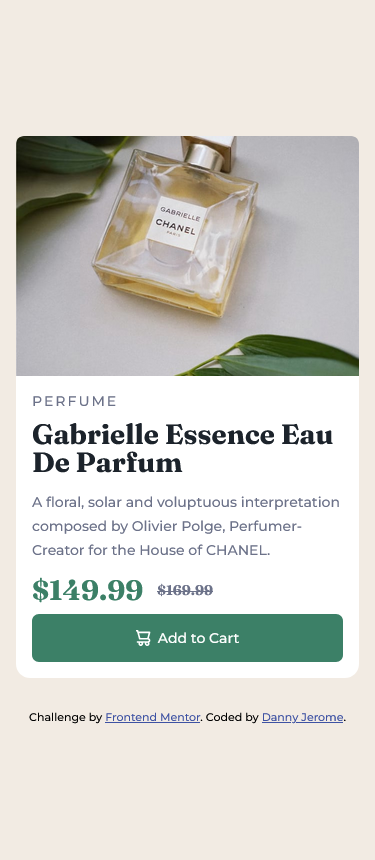

# Frontend Mentor - Product preview card component solution

This is a solution to the [Product preview card component challenge on Frontend Mentor](https://www.frontendmentor.io/challenges/product-preview-card-component-GO7UmttRfa). Frontend Mentor challenges help you improve your coding skills by building realistic projects.

## Table of contents

- [Frontend Mentor - Product preview card component solution](#frontend-mentor---product-preview-card-component-solution)
  - [Table of contents](#table-of-contents)
  - [Overview](#overview)
    - [The challenge](#the-challenge)
    - [Screenshot](#screenshot)
    - [Links](#links)
  - [My process](#my-process)
    - [Built with](#built-with)
    - [What I learned](#what-i-learned)


## Overview

### The challenge

Users should be able to:

- View the optimal layout depending on their device's screen size
- See hover and focus states for interactive elements

### Screenshot


<div style="text-align:center;">

  
</div>

### Links

- Live Site URL: [Add live site URL here](https://your-live-site-url.com)

## My process

### Built with

- Semantic HTML5 markup
- CSS custom properties
- Flexbox
- CSS Grid
- Mobile-first workflow

### What I learned

With this project i was able to learn how to use the Grid and images effectively and found new ways to incoprate different elements to the page.

```html
<picture class="product__img"> 
        <source
          srcset="images/image-product-desktop.jpg"
          media="(min-width:600px)"
        />
        
      </picture>
```

```css
.btn[data-image="shopping-cart"]::before {
  content: "";
  width: 15px;
  height: 16px;
  background-image: url(./images/icon-cart.svg);
}
```


